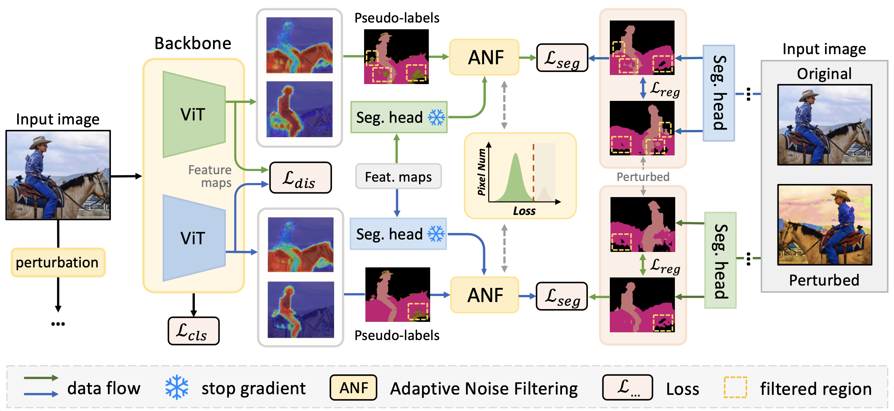

# DuPL
This repository contains the source code of CVPR 2024 paper: "DuPL: Dual Student with Trustworthy Progressive Learning for Robust Weakly Supervised Semantic Segmentation".

[](https://arxiv.org/abs/2403.11184)




### 📢 Update Log
- **Mar. 21, 2024 (U2)**: Add the evaluation / visualization scripts for CAM and segmentation inference.
- **Mar. 21, 2024 (U1)**: The pre-trained checkpoints and segmentation results released 🔥🔥🔥.
- **Mar. 17, 2024**: Basic training code released.

## Get Started

### Training Environment
The implementation is based on PyTorch 1.13.1 with single-node multi-gpu training. Please install the required packages by running:
```bash
pip install -r requirements.txt
```

### Datasets
<details>
<summary>
VOC dataset
</summary>

#### 1. Download from official website

``` bash
wget http://host.robots.ox.ac.uk/pascal/VOC/voc2012/VOCtrainval_11-May-2012.tar
tar –xvf VOCtrainval_11-May-2012.tar
```
#### 2. Download the augmented annotations
The augmented annotations are from [SBD dataset](http://home.bharathh.info/pubs/codes/SBD/download.html). Here is a download link of the augmented annotations at
[DropBox](https://www.dropbox.com/s/oeu149j8qtbs1x0/SegmentationClassAug.zip?dl=0). After downloading ` SegmentationClassAug.zip `, you should unzip it and move it to `VOCdevkit/VOC2012`. The directory should be: 

``` bash
VOCdevkit/
└── VOC2012
    ├── Annotations
    ├── ImageSets
    ├── JPEGImages
    ├── SegmentationClass
    ├── SegmentationClassAug
    └── SegmentationObject
```
</details>

<details>

<summary>
COCO dataset
</summary>

#### 1. Download
``` bash
wget http://images.cocodataset.org/zips/train2014.zip
wget http://images.cocodataset.org/zips/val2014.zip
```
#### 2. Generating VOC style segmentation labels for COCO
The training pipeline use the VOC-style segmentation labels for COCO dataset, please download the converted masks from [One Drive](https://1drv.ms/u/s!As-yzQ0hGhUXiMZUJiXOEn2pkWP80g?e=1HaHAd).
The directory should be:
``` bash
MSCOCO/
├── coco2014
│    ├── train2014
│    └── val2014
└── SegmentationClass (extract the downloaded "coco_mask.tar.gz")
     ├── train2014
     └── val2014
```
NOTE: You can also use the scripts provided at this [repo](https://github.com/alicranck/coco2voc) to covert the COCO segmentation masks.

</details>

## Experiments
### Training DuPL
#### To train the segmentation model for the VOC dataset, please run
```bash
# For Pascal VOC 2012
python -m torch.distributed.run --nproc_per_node=2 train_final_voc.py --data_folder [../VOC2012]
```
**NOTE:** The `--nproc_per_node` should be set according to your environment (recommend: 2x NVIDIA RTX 3090 GPUs
).

#### To train the segmentation model for the MS COCO dataset, please run
```bash
# For MSCOCO
python -m torch.distributed.run --nproc_per_node=4 train_final_coco.py --data_folder [../MSCOCO/coco2014]
```
**NOTE:** The `--nproc_per_node` should be set according to your environment (recommend: 4x NVIDIA RTX 3090 GPUs
).

### Evaluation
#### Please install `pydensecrf` first:
```bash
pip install git+https://github.com/lucasb-eyer/pydensecrf.git
```
**NOTE:** using `pip install pydensecrf` will install an incompatible version ⚠️.

#### To evaluate the trained model, please run:
```bash
# For Pascal VOC
python eval_seg_voc.py --data_folder [../VOC2012] --model_path [path_to_model]

# For MSCOCO
python -m torch.distributed.launch --nproc_per_node=4 eval_seg_coco_ddp.py --data_folder [../MSCOCO/coco2014] --label_folder [../MSCOCO/SegmentationClass] --model_path [path_to_model]
```
**NOTE:** 
* The segmentation results will be saved at the checkpoint directory
* DuPL has two independent models (students), and we select the best one for evaluation. IN FACT, we can use some tricks, such as `ensemble` or `model soup`, to further improve the performance (maybe).

#### Convert rgb segmentation labels for the official VOC evaluation:
```bash
# modify the "dir" and "target_dir" before running
python convert_voc_rgb.py
```

#### CAM inference  & evaluation:
```bash
python infer_cam_voc.py --data_folder [../VOC2012] --model_path [path_to_model]
```
**NOTE:** The CAM results will be saved at the checkpoint directory.

### TIPS:
* The evaluation on MS COCO use DDP to accelerate the evaluation stage. Please make sure the `torch.distributed.launch` is available in your environment.
* We highly recommend use high-performance CPU for CRF post-processing. This processing is quite time-consuming. On `MS COCO`, it may cost several hours for CRF post-processing.

## Results
### Checkpoints
We have provided DuPL's pre-trained checkpoints on VOC and COCO datasets. With these checkpoints, it should be expected to reproduce the exact performance listed below.

| Dataset    | *val* |               Log                |Weights| *val* (with MS+CRF) | *test* (with MS+CRF) |
|:-----------|:-----:|:--------------------------------:|:---:|:-------------------:|:--------------------:|
| VOC        | 69.9  |   [log](./logs/dupl_train_voc)   |[weights](https://1drv.ms/u/s!As-yzQ0hGhUXiMYD77h7fL3y-OIDcA?e=Nw9qw6)|        72.2         |         71.6         |
| VOC (21k)  |  --   | [log](./logs/dupl_train_voc_21k) |[weights](https://1drv.ms/u/s!As-yzQ0hGhUXiMV8mnHvwf1LQomHzA?e=GcuCIl)|        73.3         |         72.8         |
| COCO       |  --   |  [log](./logs/dupl_train_coco)   |[weights](https://1drv.ms/u/s!As-yzQ0hGhUXiMZhDbmPe5wlwOqItQ?e=7ikVJN)|        43.5         |          --          |
| COCO (21k) |  --   |             [log](./logs/dupl_train_coco)              |[weights](https://1drv.ms/u/s!As-yzQ0hGhUXiMZhDbmPe5wlwOqItQ?e=7ikVJN)|        44.6         |          --          |

The VOC test results are evaluated on the official server, and the result links are provided in the paper.

### Visualization
We have provided the visualization of CAMs and segmentation images (RGB) on VOC 2012 (`val` and `test`) and MS COCO in the following links. Hope they can help you to easily compare with other works :)

| Dataset           | Link                                                                                                                                                                              | Model                 |
|:------------------|-----------------------------------------------------------------------------------------------------------------------------------------------------------------------------------|:----------------------|
| VOC - Validaion   | [dupl_voc_val.zip](https://1drv.ms/u/s!As-yzQ0hGhUXiMZeAiaXQAh9-J0alA?e=1m93Fg) | DuPL (VOC test: 71.6) |
| VOC - Test        | [dupl_voc_test.zip](https://1drv.ms/u/s!As-yzQ0hGhUXiMZduJ998_wsVl06Zg?e=3ea6ph)                                                                                              | DuPL (VOC test: 71.6) |
| COCO - Validation | [dupl_coco_val.zip](https://1drv.ms/u/s!As-yzQ0hGhUXiMZf-YGj5M7_0z5yXA?e=EYjKIK)                                                                                                  | DuPL (COCO val: 43.5) |

## Citation
Please kindly cite our paper if you find it's helpful in your work:
```bibtex
@misc{wu2024dupl,
      title={DuPL: Dual Student with Trustworthy Progressive Learning for Robust Weakly Supervised Semantic Segmentation}, 
      author={Yuanchen Wu and Xichen Ye and Kequan Yang and Jide Li and Xiaoqiang Li},
      year={2024},
      eprint={2403.11184},
      archivePrefix={arXiv},
}
```


## Acknowledgement
We would like to thank all the researchers who open source their works to make this project possible, especially thanks to the authors of [Toco](https://github.com/rulixiang/ToCo/tree/main) for their brilliant work.